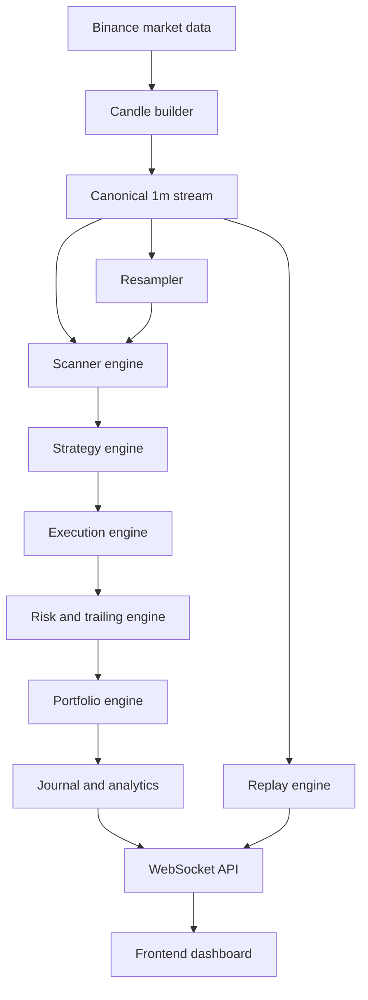

# Scalping System

Scalping System is a modular real-time trading platform scaffold for Binance
market data. It is designed around one central idea: a scalping engine should
observe market flow from a canonical `1m` stream, detect only meaningful
expansion and pullback structures, commit risk only when imbalance resumes,
extract profit quickly, and keep the remaining exposure alive only while the
market continues to earn that privilege.

This repository is not a collection of indicators or a single bot script. It is
the initial structural foundation for a complete trading operating system with
live data ingestion, scanner logic, strategy evaluation, execution control, risk
management, portfolio analytics, replay simulation, and a real-time frontend.

The codebase is deliberately modular. Each folder owns one stage of the system,
and the long-term goal is for live trading, paper trading, and replay to share
the same decision path while changing only the market-data source and execution
mode.

## Table of Contents

- [System Overview](#system-overview)
- [Architectural Philosophy](#architectural-philosophy)
- [Repository Map](#repository-map)
- [High-Level Operating Model](#high-level-operating-model)
- [Operational Workflow](#operational-workflow)
- [Historical Research Workflow](#historical-research-workflow)
- [Mode Model](#mode-model)
- [Timeframe Hierarchy](#timeframe-hierarchy)
- [Timeframe Expression](#timeframe-expression)
- [Configuration Model](#configuration-model)
- [Data Layer](#data-layer)
- [Scanner Layer](#scanner-layer)
- [Strategy Layer](#strategy-layer)
- [Execution and Risk Layer](#execution-and-risk-layer)
- [Portfolio and Journaling Layer](#portfolio-and-journaling-layer)
- [Backtest Mode](#backtest-mode)
- [Replay Layer](#replay-layer)
- [Checkpointing Model](#checkpointing-model)
- [API and Frontend Layer](#api-and-frontend-layer)
- [Testing and Verification](#testing-and-verification)
- [Outputs and Artifacts](#outputs-and-artifacts)
- [Design Invariants](#design-invariants)
- [Known Constraints and Current Boundaries](#known-constraints-and-current-boundaries)
- [Extension Guide](#extension-guide)
- [Quick Start](#quick-start)

## System Overview

At the broadest level, the platform ingests Binance market data, builds a
canonical internal candle stream, evaluates whether current conditions justify
attention, converts valid flow patterns into trade signals, executes and manages
those trades according to fixed risk rules, updates portfolio state, and pushes
the resulting state to a real-time dashboard.

That description now applies to two distinct but connected workflows. The first
is the real-time workflow, where the system is meant to react to fresh market
data with deterministic scanner, strategy, and management logic. The second is
the research workflow, where the same decision path is fed by checkpointed
historical downloads and replay/backtest runners so the strategy can be audited
against closed candles, resumed after interruption, and inspected candle by
candle without changing its internal behavior.

The initial system design is centered on a single repeatable trade lifecycle:

1. detect momentum
2. wait for a controlled pullback
3. enter on resumed expansion
4. take partial profit at `+1R`
5. move stop to breakeven
6. trail the runner while structure remains valid

The same logical path is intended to drive three operating modes:

- `replay`
- `paper`
- `live`

The current repository already includes a first-pass implementation of that
logic path:

- canonical candle building from ticks
- higher-timeframe resampling
- momentum-plus-pullback scanning
- breakout signal conversion
- risk-based position sizing
- partial, breakeven, and structural trailing rules
- portfolio accounting and an in-memory journal
- deterministic replay primitives
- typed frontend mock surfaces

## Architectural Philosophy

The platform follows a strict separation of concerns. Raw market data is
prepared before the scanner sees it. The scanner decides whether the market is
interesting enough to evaluate. The strategy decides whether a valid setup
exists. The execution layer decides how to express that setup as an order. The
risk layer decides how much capital may be exposed and how the position should
be managed. The portfolio layer records the outcome. The API layer publishes the
resulting state to the frontend.

This separation matters because trading systems become unreliable when signal
generation, trade state, and accounting are mixed together. The long-term
backend orchestrator should remain thin: it asks each specialized module for one
decision, then applies those decisions to the current state.

The system also favors event-based decisions over static state checks wherever
timing quality matters. Entry should happen on resumed imbalance, not because
price merely remains above a level. Partial exits should trigger when `+1R` is
earned, not because the trade has spent several candles above that level.

## Repository Map

| Path | Responsibility |
| --- | --- |
| `backend/app/config/` | System, strategy, and risk configuration |
| `backend/app/core/` | Orchestration, event dispatch, shared runtime behavior |
| `backend/app/data/` | Binance connectivity, candle building, resampling, and cache state |
| `backend/app/scanner/` | Real-time market-state filtering and setup preconditions |
| `backend/app/strategies/` | Strategy interfaces and pullback scalp logic |
| `backend/app/execution/` | Broker adapters, order routing, and execution control |
| `backend/app/risk/` | Position sizing, stop logic, trailing rules, and kill switches |
| `backend/app/portfolio/` | Trade ledger, analytics, equity state, and journaling |
| `backend/app/replay/` | Historical event playback and deterministic simulation |
| `backend/app/api/` | HTTP and WebSocket surfaces for the frontend |
| `backend/app/backtest/` | Checkpointed historical runner and CSV output loggers |
| `backend/tests/` | Backend tests for timing, state, and strategy behavior |
| `frontend/app/` | Next.js application routes for dashboard, replay, and portfolio views |
| `frontend/components/` | Reusable UI components such as charts, feeds, and stats panels |
| `frontend/lib/` | Client-side API and WebSocket utilities |
| `infra/` | Deployment assets such as containers, compose files, and environment templates |
| `main_download.py` | CLI entry point for checkpointed Binance history downloads |
| `main_resample.py` | CLI entry point for rebuilding higher timeframes from canonical `1m` data |
| `main_paper.py` | CLI entry point for paper-trading runtime assembly |
| `main_live.py` | CLI entry point for live-trading readiness checks |
| `main_replay.py` | CLI entry point for checkpointed replay execution |
| `main_backtest.py` | CLI entry point for checkpointed historical backtests |

## High-Level Operating Model



The key design choice is that `1m` data remains the canonical source of truth.
Any `5m`, `15m`, or higher timeframe view should be rebuilt internally so that
scanner logic, strategy logic, replay logic, and frontend visualization all
reference the same timing model.

## Operational Workflow

The intended end-to-end workflow is:

| Step | Purpose |
| --- | --- |
| `1` | connect to Binance market streams and bootstrap warmup state |
| `2` | build and persist canonical `1m` candles |
| `3` | resample higher timeframes needed by scanner and strategy modules |
| `4` | run scanner filters to decide whether the current market state deserves attention |
| `5` | evaluate the pullback-scalp strategy on closed execution candles |
| `6` | route valid signals to paper or live execution |
| `7` | manage the trade through partials, breakeven logic, and runner trailing |
| `8` | update portfolio metrics, journal fields, and dashboard state |
| `9` | stream all updates to the frontend over WebSockets |
| `10` | reuse the same logic path in replay mode with historical event pacing |

The practical implication is that the platform is built around one canonical
market narrative rather than separate "live logic" and "research logic." The
market can arrive through WebSocket ticks, through REST-downloaded one-minute
history, or through a replay cursor over previously saved data, but once the
system has a closed execution candle and its supporting context candles, the
scanner and strategy are supposed to see the same structural picture.

## Historical Research Workflow

The repository now includes a concrete historical path rather than only a
theoretical live architecture. The workflow is intentionally disk-backed and
checkpointed because one-minute Binance history is large enough that restart
cost matters.

The historical path starts with a public Binance REST client that downloads raw
klines in batches, writes each batch immediately to a partial CSV, and records a
JSON checkpoint after each save boundary. That means an interrupted history
download does not have to restart from the first candle. Once canonical `1m`
history exists on disk, the timeframe builder rebuilds the configured derived
bars, writes them back under the symbol/timeframe folder structure, and makes
those frames available to replay and backtest runners. The backtest runner then
uses the same replay engine and trading engine contracts already present in the
real-time architecture, but wraps them in CSV logging and periodic checkpoints
so multi-step historical simulations can resume deterministically.

## Mode Model

The platform is designed around three execution modes:

| Mode | Purpose | Data source | Execution target |
| --- | --- | --- | --- |
| `replay` | training and research | historical candles or event streams | simulator only |
| `paper` | forward validation | live market data | simulated orders and fills |
| `live` | production trading | live market data plus account stream | exchange orders |

The core design invariant is that scanner, strategy, and risk logic should not
fork by mode. Mode should change data and execution adapters, not the decision
engine itself.

## Timeframe Hierarchy

The system is intentionally multi-timeframe even though `1m` remains canonical.

| Timeframe | Role | Intended use |
| --- | --- | --- |
| `1m` | canonical market stream | source of truth for all resampling |
| `5m` | default execution timeframe | higher-frequency scalp execution aligned to repetition |
| `15m` | secondary execution/context timeframe | slower, cleaner continuation structure |
| `1h` | directional context | session bias and higher-level alignment |

Additional timeframes may be added later, but they should still be rebuilt from
the same `1m` source rather than introduced as external, pre-aggregated truth.

## Timeframe Expression

The strategy logic does not change when moving from `5m` to `15m`, but the
expression of that logic changes materially.

| Dimension | `5m` profile | `15m` profile |
| --- | --- | --- |
| Tempo | fast | slow |
| Setup frequency | higher | lower |
| Noise tolerance | slightly higher | lower |
| Stop width | tighter in absolute terms | wider in absolute terms |
| Expected trade count | better aligned to repeated daily participation | better aligned to selective continuation |
| Runner importance | secondary but still valuable | materially more important |
| Psychological demand | quick repetition and immediate feedback | patience and tolerance for inactivity |

The repository now encodes that distinction through timeframe profiles in
[`strategy.example.yaml`](backend/app/config/strategy.example.yaml). The default
example runtime uses the `5m` profile because it aligns more closely with the
stated research objective of repeated intraday participation, while `15m`
remains available as a slower, cleaner alternative.

## Configuration Model

The scaffold includes example YAML files under `backend/app/config/`.

| File | Purpose |
| --- | --- |
| `system.example.yaml` | runtime mode, symbols, session windows, storage, and transport settings |
| `system.example.yaml -> account` | initial equity and reporting currency |
| `system.example.yaml -> binance` | REST endpoint, retry, timeout, TLS, and throttling behavior |
| `system.example.yaml -> history` | default historical research date range |
| `system.example.yaml -> downloads` | partial-file and checkpoint policy for history downloads |
| `system.example.yaml -> resample` | pandas resample semantics and incomplete-candle handling |
| `system.example.yaml -> backtest / replay` | periodic checkpoint cadence and output locations |
| `strategy.example.yaml` | scanner thresholds, setup definitions, and entry triggers |
| `strategy.example.yaml -> profiles` | timeframe-specific scanner, trigger, and cadence expectations |
| `risk.example.yaml` | risk per trade, partial rules, trailing rules, and daily guardrails |

Long-term configuration goals:

- keep thresholds in config rather than hardcoding them across modules
- allow safe switching between `replay`, `paper`, and `live`
- define symbols, sessions, and execution permissions centrally
- preserve an auditable record of the config that produced each run

## Data Layer

The data layer is responsible for turning exchange traffic into a trusted local
market state.

Target responsibilities:

- stream Binance market data
- rebuild canonical `1m` candles
- resample higher timeframes
- detect candle close boundaries deterministically
- cache recent history for warmup and recovery
- support replay from persisted history

This layer should eventually support both market-data streams and account/order
streams, because live execution cannot be managed correctly from price data
alone.

In practical terms, the data layer now has three distinct responsibilities. The
first is low-latency event normalization for real-time work, which is handled by
the tick and candle-building path already present in the repository. The second
is resilient batch acquisition for historical work, which is now handled by the
Binance REST client and the `MarketDataDownloader`. The third is conversion
between pandas-based research artifacts and the internal `Candle` objects used
by replay, scanner, and strategy code. That bridge matters because the project
needs both worlds: pandas is efficient and inspectable for download/resample
pipelines, while explicit dataclasses are cleaner for deterministic step-by-step
simulation.

### Binance REST Client

[`backend/app/data/binance_rest.py`](backend/app/data/binance_rest.py) provides a
small public market-data client with retry, backoff, retryable status-code
handling, TLS verification control, optional custom CA bundle support, and a
compatibility path for future authenticated headers. The important design choice
is that network behavior is configuration-driven rather than hardcoded, because
long-running market-data jobs need to survive transient HTTP failures, rate
limits, and corporate TLS quirks without forcing ad hoc code edits.

### MarketDataDownloader

[`backend/app/data/downloader.py`](backend/app/data/downloader.py) is the
disk-backed heart of the research workflow. It converts raw Binance klines into
validated OHLCV DataFrames, strips still-forming candles when configured to use
closed bars only, writes historical batches incrementally to partial CSVs,
stores JSON checkpoints after save boundaries, resumes from either a checkpoint
or the last partial candle, and can bootstrap an extended request range from an
older completed file rather than redownloading the entire history window from
scratch.

### TimeframeBuilder

[`backend/app/data/timeframe_builder.py`](backend/app/data/timeframe_builder.py)
rebuilds configured higher timeframes from the canonical `1m` DataFrame and
persists each result under the same symbol/timeframe storage tree. Resampled
candles use explicit pandas resample semantics from configuration, and the
builder drops incomplete higher-timeframe bars by default so scanner and
strategy code never see a candle whose close boundary has not actually been
earned by the available source data.

## Scanner Layer

The scanner is not the strategy. Its job is to reduce noise.

Target responsibilities:

- detect meaningful movement intensity
- detect controlled pullbacks or compressive pauses
- reject equilibrium-like conditions
- produce a context summary that downstream modules can interpret

In practical terms, the scanner should answer:

> Is the market coherent enough to justify attention right now?

## Strategy Layer

The first strategy family is a pullback scalp around resumed imbalance.

Target responsibilities:

- read scanner output and recent candle structure
- decide whether trend, pullback, and trigger conditions align
- emit a directional signal with entry, invalidation, and metadata

The strategy should remain narrow. It should not manage orders, size positions,
or mutate portfolio state.

## Execution and Risk Layer

The execution and risk layers turn a valid idea into controlled exposure.

Target execution responsibilities:

- translate signals into exchange or simulated orders
- handle acknowledgements, rejections, and retries
- track open orders and fills
- reconcile broker state with internal state

Target risk responsibilities:

- size positions from configured risk limits
- place initial invalidation stops
- close partial size at `+1R`
- move stop to breakeven after the first partial
- trail the runner with simple structural logic
- enforce daily loss and session kill switches

## Portfolio and Journaling Layer

The portfolio layer is the system memory.

Target responsibilities:

- track realized and unrealized PnL
- track equity, drawdown, and trade distributions
- log per-trade context, reasoning, and management events
- support session-level and mode-level analytics

The journal should eventually preserve not only what the trade earned, but why
the system entered, how it managed risk, and what the market looked like at the
time.

## Backtest Mode

The repository now includes a checkpointed backtest runner under
[`backend/app/backtest/`](backend/app/backtest/). The backtest path is not a
separate strategy implementation. It loads canonical `1m` history, rebuilds the
configured higher timeframes, converts them into internal candle objects,
replays the execution timeframe one closed candle at a time, and lets the
existing trading engine make every scanner, entry, and management decision. The
runner writes `trades.csv` and `equity.csv` outputs, and it periodically stores
the next replay index in a checkpoint file so a long historical pass can resume
without discarding previous progress.

## Replay Layer

Replay is not a separate strategy environment. It is the same engine with a
different clock.

Target responsibilities:

- load historical market data
- emit candle events in deterministic order
- support pause, play, and step controls
- use the same scanner, strategy, and risk logic as live mode
- publish replay state to the same frontend surface

This makes replay useful both for operator training and for debugging the
strategy lifecycle candle by candle.

The repository now includes a replay runner that loads historical candles from
saved `1m` history, rebuilds derived frames in memory, and advances the replay
cursor in configurable chunks. Its checkpoint file records the current index so
replay sessions can be resumed after interruption without losing position and
portfolio state, because the runner reconstructs the same engine state by
fast-forwarding deterministically from the beginning of the historical dataset
to the saved cursor.

## Checkpointing Model

Checkpointing is treated as a cross-cutting concern rather than a one-off
feature. The downloader, replay runner, and backtest runner all write atomic
JSON checkpoints through the same
[`JsonCheckpointStore`](backend/app/core/checkpoints.py) helper. The store uses
temporary files plus replace-with-retry behavior so checkpoint updates survive
common Windows and OneDrive file-lock edge cases more reliably than a direct
overwrite. The repository currently uses this mechanism in three places:

- historical download resume points
- replay cursor persistence
- backtest execution progress

That does not mean every future module should serialize arbitrary runtime state.
The current design is intentionally pragmatic: where possible, the system saves
the next deterministic cursor and reconstructs prior state by replaying the same
closed-candle history rather than depending on opaque binary snapshots.

## API and Frontend Layer

The frontend should act as an operator console rather than a passive chart.

Target frontend responsibilities:

- render live or replay candles smoothly
- show open trades, fills, and PnL in real time
- expose scanner and strategy reasoning in readable form
- display session stats, win rate, average `R`, and drawdown
- let the operator switch between replay, paper, and live contexts

The API layer should expose both request/response endpoints and a real-time
WebSocket stream for candles, signals, trades, portfolio state, and health
events.

## Testing and Verification

The repository includes focused backend unit tests for the core deterministic
mechanics.

Covered behaviors:

- `CandleBuilder` closes candles correctly and fills minute gaps deterministically
- `JsonCheckpointStore` round-trips atomic JSON checkpoint files
- `MarketDataDownloader.klines_to_df()` filters still-forming candles correctly
- `TimeframeResampler` rebuilds higher-timeframe candles from canonical `1m` data
- `TimeframeBuilder` resamples using the configured research semantics and drops incomplete higher-timeframe bars
- `MomentumScanner` recognizes a valid impulse-plus-pullback narrative
- `PullbackScalpStrategy` emits a trade signal only when the trigger candle confirms
- timeframe-profile resolution selects the correct execution expression
- `RiskManager` sizes a trade from fixed account risk
- `TrailingEngine` takes the first partial and moves the stop to breakeven

The current tests are intentionally focused on deterministic mechanics rather
than exchange I/O. Network-heavy flows such as the public Binance downloader are
tested indirectly through their closed-candle transformation logic, while the
retrying HTTP path remains exercised primarily through real command-line runs.

## Outputs and Artifacts

The repository now writes concrete artifacts for historical workflows.

Historical data artifacts:

- `data_storage/<symbol>/1m/*.csv` for canonical one-minute history
- `data_storage/<symbol>/<timeframe>/*.csv` for resampled derived frames
- `data_storage/<symbol>/<interval>/_checkpoints/*.checkpoint.json` for download resume state

Research artifacts:

- `backtest/output/trades.csv`
- `backtest/output/equity.csv`
- `backtest/output/_checkpoints/*.checkpoint.json`
- `replay/output/_checkpoints/*.checkpoint.json`

These files are part of the intended working model rather than incidental logs.
They allow the repository to behave like a restartable research environment
instead of a fire-and-forget script collection.

Test command:

```bash
python -m unittest discover -s backend/tests -v
```

## Design Invariants

| Invariant | Why it matters |
| --- | --- |
| `1m` remains the canonical source of truth | prevents hidden timing drift across modules |
| strategy decisions use closed candles only | avoids lookahead and mid-candle noise |
| scanner and strategy remain separate concerns | keeps setup filtering distinct from entry conversion |
| mode does not fork the decision engine | preserves replay, paper, and live consistency |
| initial trade risk is defined before order submission | removes ambiguous post-entry management |
| partial and breakeven logic are rule-based | keeps management deterministic |
| portfolio and journal state are first-class outputs | supports later forensic review |
| business profit targets are measurements, not assumptions | the code should evaluate whether targets are realistic rather than hardcode them |

## Known Constraints and Current Boundaries

This repository is now a working foundation, not a finished trading engine.

Current boundaries:

- live Binance order submission is still intentionally unimplemented
- live account-stream reconciliation and exchange position syncing are not implemented yet
- database-backed persistence and restart recovery are not implemented yet
- the frontend is a typed mock console, not a live Next.js-integrated application yet
- FastAPI transport wiring is not implemented yet; API routes and WebSocket broadcasting are placeholders
- there is no database, no fee model, and no slippage model yet
- daily target objectives such as `10-15` trades or `EUR 300-EUR 500` profit are not encoded as assumptions and must be validated empirically
- there is no production secrets handling, deployment hardening, or exchange failover path yet

That boundary is intentional. The current implementation is meant to lock down
the rule path and package boundaries before exchange integration and persistence
complexity are added.

## Extension Guide

The safest way to extend the project is to preserve the separation of concerns
described above.

| Goal | Best extension point |
| --- | --- |
| add exchange settings or mode defaults | `backend/app/config/` |
| add new candle transforms or cache logic | `backend/app/data/` |
| add a new market-state filter | `backend/app/scanner/` |
| add a new setup family | `backend/app/strategies/` |
| change order routing behavior | `backend/app/execution/` |
| modify stop or trailing behavior | `backend/app/risk/` |
| add performance views or journaling fields | `backend/app/portfolio/` |
| extend replay controls | `backend/app/replay/` |
| add operator endpoints or stream topics | `backend/app/api/` |
| add dashboard widgets | `frontend/components/` |

## Quick Start

### 1. Install Python dependencies

```bash
pip install -r requirements.txt
```

### 2. Create a local environment file

```text
copy .env.template .env
```

If you are behind a corporate TLS proxy or custom certificate chain, the
runtime supports two environment overrides:

```text
BINANCE_SSL_VERIFY=false
BINANCE_CA_BUNDLE_PATH=C:\path\to\corp-ca.pem
```

Use the custom CA bundle path when possible. Disable verification only when you
understand the risk and need a temporary local workaround.

### 3. Review the scaffold configuration

Start with:

```text
backend/app/config/system.example.yaml
backend/app/config/strategy.example.yaml
backend/app/config/risk.example.yaml
```

### 4. Verify the backend foundation

Run the test suite:

```bash
python -m unittest discover -s backend/tests -v
```

### 5. Inspect the runtime entry points

The repository already exposes the intended runtime surface:

```bash
python main_download.py
python main_resample.py
python main_paper.py
python main_live.py
python main_replay.py
python main_backtest.py
```

The download, resample, replay, and backtest commands now perform real work.
The paper and live commands still act primarily as runtime-assembly and safety
checks because authenticated broker execution is not implemented yet.

### 6. Inspect the frontend shell

The frontend now includes a typed Next.js shell under `frontend/` with mock
dashboard, replay, and portfolio pages. It is meant to anchor component
contracts and visual structure before live API integration.

### 7. Continue implementation

The next engineering steps should be:

1. authenticated Binance market and account streams
2. persistent storage for candles, fills, positions, and journal events
3. FastAPI route wiring and real WebSocket transport
4. live frontend data binding
5. richer backtest outputs, fee/slippage models, and session analytics

## Closing Note

The platform is best understood as a trading operating system rather than a
single strategy script. Its strength will come not only from the edge itself,
but from the discipline with which data handling, market interpretation,
execution, risk, accounting, replay, and visualization are kept modular,
auditable, and synchronized.
