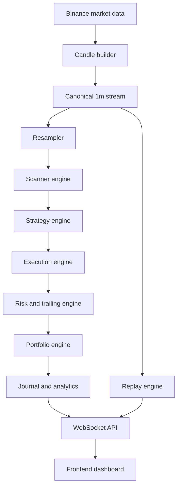
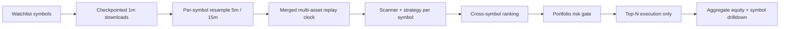
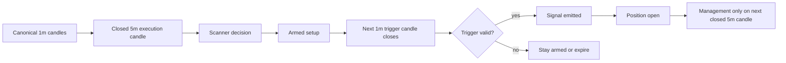
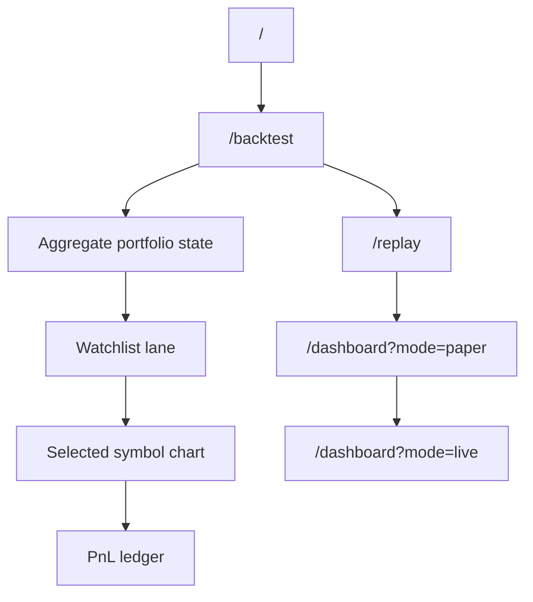

# QuantFund AI Scalping System

Scalping System is a modular real-time trading platform scaffold for Binance
market data. It is designed around one central idea: a scalping engine should
observe market flow from a canonical `1m` stream, detect only meaningful
expansion and pullback structures, commit risk only when imbalance resumes,
extract profit quickly, and keep the remaining exposure alive only while the
market continues to earn that privilege.

This repository is not a collection of indicators or a single bot script. It is
the initial structural foundation for a complete trading operating system with
live data ingestion, scanner logic, strategy evaluation, execution control, risk
management, portfolio analytics, replay simulation, and a real-time frontend.

The codebase is deliberately modular. Each folder owns one stage of the system,
and the long-term goal is for live trading, paper trading, and replay to share
the same decision path while changing only the market-data source and execution
mode.

The current research stack is no longer limited to one symbol at a time. The
system can now download and audit a watchlist, replay multiple execution tapes
through one shared portfolio engine, rank same-timestamp signals across symbols,
and take only the strongest opportunities that fit the configured open-risk
budget. In plain language, the platform now follows the professional rule that
matters most for intraday research:

`scan many, trade few`

## Table of Contents

- [System Overview](#system-overview)
- [Architectural Philosophy](#architectural-philosophy)
- [Repository Map](#repository-map)
- [High-Level Operating Model](#high-level-operating-model)
- [Current Refactor Snapshot](#current-refactor-snapshot)
- [Operational Workflow](#operational-workflow)
- [Historical Research Workflow](#historical-research-workflow)
- [Mode Model](#mode-model)
- [Timeframe Hierarchy](#timeframe-hierarchy)
- [Clock and Trigger Model](#clock-and-trigger-model)
- [Timeframe Expression](#timeframe-expression)
- [Configuration Model](#configuration-model)
- [Data Layer](#data-layer)
- [Scanner Layer](#scanner-layer)
- [Strategy Layer](#strategy-layer)
- [Execution and Risk Layer](#execution-and-risk-layer)
- [Portfolio and Journaling Layer](#portfolio-and-journaling-layer)
- [Backtest Mode](#backtest-mode)
- [Post-Backtest Validation](#post-backtest-validation)
- [Replay Layer](#replay-layer)
- [Checkpointing Model](#checkpointing-model)
- [API and Frontend Layer](#api-and-frontend-layer)
- [Message Bus Guidance](#message-bus-guidance)
- [Testing and Verification](#testing-and-verification)
- [Outputs and Artifacts](#outputs-and-artifacts)
- [Design Invariants](#design-invariants)
- [Known Constraints and Current Boundaries](#known-constraints-and-current-boundaries)
- [Extension Guide](#extension-guide)
- [Quick Start](#quick-start)

## System Overview

At the broadest level, the platform ingests Binance market data, builds a
canonical internal candle stream, evaluates whether current conditions justify
attention, converts valid flow patterns into trade signals, executes and manages
those trades according to fixed risk rules, updates portfolio state, and pushes
the resulting state to a real-time dashboard.

That description now applies to two distinct but connected workflows. The first
is the real-time workflow, where the system is meant to react to fresh market
data with deterministic scanner, strategy, and management logic. The second is
the research workflow, where the same decision path is fed by checkpointed
historical downloads and replay/backtest runners so the strategy can be audited
against closed candles, resumed after interruption, and inspected candle by
candle without changing its internal behavior.

The initial system design is centered on a single repeatable trade lifecycle:

1. detect momentum
2. wait for a controlled pullback
3. enter on resumed expansion
4. take partial profit at `+1R`
5. move stop to breakeven
6. trail the runner while structure remains valid

The same logical path is intended to drive three operating modes:

- `replay`
- `paper`
- `live`

The current repository already includes a first-pass implementation of that
logic path:

- canonical candle building from ticks
- higher-timeframe resampling
- momentum-plus-pullback scanning
- breakout signal conversion
- risk-based position sizing
- partial, breakeven, and structural trailing rules
- portfolio accounting and an in-memory journal
- deterministic replay primitives
- typed frontend mock surfaces

## Architectural Philosophy

The platform follows a strict separation of concerns. Raw market data is
prepared before the scanner sees it. The scanner decides whether the market is
interesting enough to evaluate. The strategy decides whether a valid setup
exists. The execution layer decides how to express that setup as an order. The
risk layer decides how much capital may be exposed and how the position should
be managed. The portfolio layer records the outcome. The API layer publishes the
resulting state to the frontend.

This separation matters because trading systems become unreliable when signal
generation, trade state, and accounting are mixed together. The long-term
backend orchestrator should remain thin: it asks each specialized module for one
decision, then applies those decisions to the current state.

The system also favors event-based decisions over static state checks wherever
timing quality matters. Entry should happen on resumed imbalance, not because
price merely remains above a level. Partial exits should trigger when `+1R` is
earned, not because the trade has spent several candles above that level.

## Repository Map

| Path | Responsibility |
| --- | --- |
| `backend/app/config/` | System, strategy, and risk configuration |
| `backend/app/core/` | Orchestration, event dispatch, shared runtime behavior |
| `backend/app/console/` | Rich-powered operator dashboards for CLI commands |
| `backend/app/data/` | Binance connectivity, candle building, resampling, and cache state |
| `backend/app/scanner/` | Real-time market-state filtering and setup preconditions |
| `backend/app/strategies/` | Strategy interfaces and pullback scalp logic |
| `backend/app/execution/` | Broker adapters, order routing, and execution control |
| `backend/app/risk/` | Position sizing, stop logic, trailing rules, and kill switches |
| `backend/app/portfolio/` | Trade ledger, analytics, equity state, and journaling |
| `backend/app/replay/` | Historical event playback and deterministic simulation |
| `backend/app/live/` | Forward paper/live runners over fresh closed Binance data |
| `backend/app/api/` | HTTP and WebSocket surfaces for the frontend |
| `backend/app/backtest/` | Checkpointed historical runner and CSV output loggers |
| `backend/tests/` | Backend tests for timing, state, and strategy behavior |
| `frontend/app/` | Next.js application routes for dashboard, replay, and portfolio views |
| `frontend/components/` | Reusable UI components such as charts, feeds, and stats panels |
| `frontend/lib/` | Client-side API and WebSocket utilities |
| `infra/` | Deployment assets such as containers, compose files, and environment templates |
| `main_download.py` | CLI entry point for checkpointed Binance history downloads |
| `main_download_watchlist.py` | CLI entry point for watchlist-wide checkpointed history downloads |
| `main_resample.py` | CLI entry point for rebuilding higher timeframes from canonical `1m` data |
| `main_paper.py` | CLI entry point for checkpointed forward paper-trading loops |
| `main_live.py` | CLI entry point for checkpointed forward live-scanning loops |
| `main_replay.py` | CLI entry point for checkpointed replay execution |
| `main_backtest.py` | CLI entry point for checkpointed historical backtests |

## High-Level Operating Model



The key design choice is that `1m` data remains the canonical source of truth.
Any derived execution or context view should be rebuilt internally so that
scanner logic, strategy logic, replay logic, and frontend visualization all
reference the same timing model. In the current default runtime, that means the
system rebuilds `5m` from `1m` because `5m` is the active scalp clock. Slower
views such as `15m` are still supported as alternate strategy expressions, but
they are not supposed to be materialized by default unless the active config
actually needs them.

## Current Refactor Snapshot

The repository is no longer in the earlier hybrid state where a `5m` backtest
could look as if it were using `1m` precision while still making decisions with
information that only became visible after the entire `5m` bar had closed. The
current refactor package hardened both the backend timing semantics and the
frontend representation of those semantics.

The most important changes are:

| Area | What changed | Why it matters |
| --- | --- | --- |
| Lower-timeframe trigger honesty | the engine now distinguishes `execution_timeframe`, `trigger_timeframe`, and `clock_timeframe` | removes the earlier intrabar hindsight path |
| Backtest / replay stepping | historical engines now advance on the true resolved clock rather than assuming execution-timeframe stepping | lets a `5m` setup use a real `1m` trigger without lying about time |
| Setup lifecycle | scanner decisions can now be armed at the execution close and evaluated later on the next valid trigger candle | makes trigger timing event-driven instead of retroactive |
| Position management | `bars_held` and management decisions advance only on a new execution close, even if the clock is faster | keeps trade management consistent with the strategy’s execution frame |
| Watchlist defaults | the research watchlist is now intentionally diversified and evidence-pruned | moves the system away from redundant alt-L1 clustering |
| Backtest viewer contract | `/backtest` now exposes execution layer, clock layer, trigger layer, focus symbol, and evidence-pruning hints directly in the UI | prevents the frontend from presenting a fake “5m-only” narrative |
| Brand shell | the frontend root and global dock now present the system as `QuantFund AI` | gives the operator cockpit one coherent product identity |

### Current default research universe

The current `system.example.yaml` watchlist is:

| Bucket | Default symbol | Why it is in the universe |
| --- | --- | --- |
| Core beta | `BTCUSDT` | benchmark crypto beta and primary tape |
| Smart-contract core | `ETHUSDT` | broad secondary leader and liquidity anchor |
| Exchange-chain | `BNBUSDT` | exchange / BNB-chain factor |
| High-beta L1 | `SOLUSDT` | fast expansion candidate without stacking multiple similar L1s |
| Oracle / infra | `LINKUSDT` | infrastructure-style crypto factor |
| Payments | `XRPUSDT` | different participation profile from core beta |
| DeFi lending | `AAVEUSDT` | DeFi expression without overloading the universe |
| Payments alt | `TRXUSDT` | alternate payments / flow bucket |

This is not presented as a claim that these assets are truly uncorrelated in an
absolute sense. The point is narrower and more practical: the default universe
is now shaped to reduce redundant overlap relative to a basket made mostly of
`BTC + ETH + multiple similar L1s`. The rule going forward is not “keep every
symbol forever.” The rule is `prune by evidence`.

## Operational Workflow

The intended end-to-end workflow is:

| Step | Purpose |
| --- | --- |
| `1` | connect to Binance market streams and bootstrap warmup state |
| `2` | build and persist canonical `1m` candles |
| `3` | resample higher timeframes needed by scanner and strategy modules |
| `4` | run scanner filters to decide whether the current market state deserves attention |
| `5` | evaluate the pullback-scalp strategy on closed execution candles |
| `6` | route valid signals to paper or live execution |
| `7` | manage the trade through partials, breakeven logic, and runner trailing |
| `8` | update portfolio metrics, journal fields, and dashboard state |
| `9` | stream all updates to the frontend over WebSockets |
| `10` | reuse the same logic path in replay mode with historical event pacing |

The practical implication is that the platform is built around one canonical
market narrative rather than separate "live logic" and "research logic." The
market can arrive through WebSocket ticks, through REST-downloaded one-minute
history, or through a replay cursor over previously saved data, but once the
system has a closed execution candle and its supporting context candles, the
scanner and strategy are supposed to see the same structural picture.

That same philosophy now extends to the console surface. Long-running commands
no longer rely on uncontrolled print streams alone. The repository now includes
Rich-powered in-place dashboards that present phase, progress, elapsed time,
remaining time, operational metrics, and recent events in one stable operator
view. The point is not cosmetics for their own sake. A trading research and
execution stack becomes materially easier to trust when the console exposes what
the process is doing, where it is in the workflow, what it has already
processed, and whether it is waiting, resuming, or completing without flooding
the terminal with flickering output.

There is now also a concrete forward-execution path rather than only a
historical one. In paper and live modes, the runner bootstraps a warm `1m`
state from local history when available, fetches recent closed `1m` candles
once to synchronize startup state, and then diverges into two different forward
transport models. The paper runner can still advance from periodic REST refresh
cycles, which is useful when the operator wants a bounded dry-run over fresh
data without committing to a persistent market socket. The live runner now
advances from a real Binance public WebSocket subscription on closed `1m`
kline events, continuously rebuilding the active `5m` execution frame plus the
`15m` context frame and feeding only newly closed `5m` candles into the same
trading engine used elsewhere in the repository. That means the live path is no
longer a special-case scanner loop. It is a checkpointed state machine driven
by exchange stream events.

## Historical Research Workflow

The repository now includes a concrete historical path rather than only a
theoretical live architecture. The workflow is intentionally disk-backed and
checkpointed because one-minute Binance history is large enough that restart
cost matters.

The historical path starts with a public Binance REST client that downloads raw
klines in batches, writes each batch immediately to a partial CSV, and records a
JSON checkpoint after each save boundary. That means an interrupted history
download does not have to restart from the first candle. Once canonical `1m`
history exists on disk, the timeframe builder rebuilds the configured derived
bars, writes them back under the symbol/timeframe folder structure, and makes
those frames available to replay and backtest runners. The backtest runner then
uses the same replay engine and trading engine contracts already present in the
real-time architecture, but wraps them in CSV logging and periodic checkpoints
so multi-step historical simulations can resume deterministically.

The research path is now also explicitly `watchlist-aware`. Instead of assuming
that one symbol must carry the entire frequency burden, the system can download
multiple canonical `1m` histories, resample each symbol independently, merge the
execution timeline into one deterministic multi-asset replay, and route all
candidate signals through a portfolio selector. That selector enforces account
constraints such as maximum simultaneous positions, maximum total open risk, and
maximum positions per symbol before any signal is executed. In other words, the
research loop has moved from “does BTC alone produce enough opportunities?” to
“given a professional watchlist, which setups would the shared account actually
take?”

The current refactor takes that one step further. The codebase now assumes that
watchlist construction is part of the edge model itself. The default universe
is intentionally diversified across factor buckets, the selector can prune by
evidence instead of by preference, and the backtest UI now exposes that
evidence directly through per-symbol `keep / watch / prune` guidance. That
means research is no longer just “did this symbol fire?” It is “did this symbol
earn one of the limited portfolio slots at that time, and is it still earning
its place in the universe over a meaningful sample?”

### Watchlist Research Flow



| Stage | What happens | Why it matters |
| --- | --- | --- |
| `1` | download canonical `1m` data for each symbol | ensures every derived frame comes from the same timing truth |
| `2` | audit data quality and gap structure | prevents corrupted history from quietly polluting the backtest |
| `3` | rebuild `5m` and `15m` from `1m` | avoids stale or inconsistent higher-timeframe files |
| `4` | replay all execution candles under one portfolio clock | creates a realistic same-account competition between symbols |
| `5` | rank signals by setup quality, context, and regime | prevents correlated overtrading |
| `6` | execute only the best setups that fit account risk | turns a watchlist into a portfolio instead of a signal flood |

## Mode Model

The platform is designed around three execution modes:

| Mode | Purpose | Data source | Execution target |
| --- | --- | --- | --- |
| `replay` | training and research | historical candles or event streams | simulator only |
| `paper` | forward validation | live market data | simulated orders and fills |
| `live` | production trading | live market data plus account stream | exchange orders |

The core design invariant is that scanner, strategy, and risk logic should not
fork by mode. Mode should change data and execution adapters, not the decision
engine itself.

That invariant now holds across three concrete runner families:

- replay uses deterministic historical snapshots
- backtest wraps replay in CSV logging and historical checkpointing
- paper forward runners can poll fresh `1m` data, rebuild the active frames, and checkpoint operational state between cycles
- live forward runners advance from closed `1m` WebSocket candles and optionally pair that market stream with a private account stream for exchange reconciliation

## Timeframe Hierarchy

The current default runtime is intentionally narrow, but it is no longer
single-timeframe in spirit. Right now the live scalp path is built around
canonical `1m` market data, derived `5m` execution candles, and a soft `15m`
context layer. That combination matches the current trading philosophy more
closely than either a pure `5m` view or a fully gated higher-timeframe model.
The `5m` chart is fast enough to generate repeated intraday opportunities,
while the `15m` chart is slow enough to reveal whether those opportunities are
appearing inside clean continuation structure or inside noise.

| Timeframe | Default role | Intended use |
| --- | --- | --- |
| `1m` | canonical market stream | source of truth for all resampling |
| `5m` | active execution timeframe | default scalp execution aligned to repetition |
| `15m` | active soft context layer | slower structural lens for interpreting `5m` setups |
| `1h` | optional future context layer | directional bias only if higher-timeframe gating is re-enabled |

That distinction matters because support is not the same thing as obligation.
The repository may know how to express the strategy on `15m` as a primary
execution clock, but in the default runtime `15m` exists first as context for
`5m`, not as a second execution engine competing for control. Likewise, `1h`
belongs to a future context-filter path, not to the current live scanner.
Additional timeframes may be added later, but they should still be rebuilt from
the same `1m` source rather than introduced as external, pre-aggregated truth.

## Clock and Trigger Model

The engine no longer treats “execution timeframe” and “simulation clock” as the
same concept by default. This matters most whenever a setup is structurally
defined on one timeframe but triggered on a faster one.

The current timing contract is:

| Layer | Meaning | Current default `5m` profile |
| --- | --- | --- |
| `canonical timeframe` | source of truth on disk and in memory | `1m` |
| `execution timeframe` | where the setup is defined and where management cadence lives | `5m` |
| `trigger timeframe` | where the entry confirmation candle must close | `1m` |
| `clock timeframe` | the actual event loop that advances replay/backtest/live state | resolved to the faster of execution and trigger, so `1m` for the default `5m` profile |

### Why this refactor was necessary

The earlier hybrid approach could arm a valid `5m` setup and then retrospectively
search all `1m` candles inside the already-closed `5m` bar to pick the first
valid trigger. That made the backtest look precise, but it was semantically
wrong because the engine was benefiting from information that had not yet been
earned at the earlier `1m` trigger close.

The new rule is stricter:

1. a valid scanner decision is formed on the `5m` execution close
2. that decision is stored as an armed setup
3. only the current `1m` candle after that execution close is allowed to fire
4. position management still advances only when a new `5m` execution candle has actually closed

### Timing flow



This distinction is now reflected end to end:

- configuration resolves a `clock_timeframe`
- timeframe building includes whatever frames the clock/trigger/context stack needs
- replay and backtest step on the resolved clock
- live and paper runners honor the same timing rule
- the frontend now surfaces execution, clock, and trigger as separate layers

## Timeframe Expression

The strategy logic does not change when moving from `5m` to `15m`, but the
expression of that logic changes materially.

| Dimension | `5m` profile | `15m` profile |
| --- | --- | --- |
| Tempo | fast | slow |
| Setup frequency | higher | lower |
| Noise tolerance | slightly higher | lower |
| Stop width | tighter in absolute terms | wider in absolute terms |
| Expected trade count | better aligned to repeated daily participation | better aligned to selective continuation |
| Runner importance | secondary but still valuable | materially more important |
| Psychological demand | quick repetition and immediate feedback | patience and tolerance for inactivity |

The repository now encodes that distinction through timeframe profiles in
[`strategy.example.yaml`](backend/app/config/strategy.example.yaml). The default
example runtime uses the `5m` profile because it aligns more closely with the
stated research objective of repeated intraday participation, while `15m`
remains available as a slower, cleaner alternative.

The current runtime also uses `15m` in a second, more practical way: as a soft
context layer for `5m` signals. That means the slower timeframe is allowed to
influence confidence and position aggressiveness without blocking every
misaligned trade. A `5m` setup that appears inside supportive `15m` structure
keeps full risk, a setup appearing inside mixed context is sized down modestly,
and a setup appearing against a clearly opposing `15m` structure is sized down
more aggressively. The important point is that trade frequency should compress
only modestly under this model because context is guiding, not suffocating, the
execution layer.

## Configuration Model

The scaffold includes example YAML files under `backend/app/config/`.

| File | Purpose |
| --- | --- |
| `system.example.yaml` | runtime mode, symbols, session windows, storage, and transport settings |
| `system.example.yaml -> account` | initial equity and reporting currency; the current default base capital is `25,000 EUR` |
| `system.example.yaml -> binance` | REST endpoints, WebSocket endpoints, retry, timeout, TLS, throttling, stream reconnect, and order reconciliation behavior |
| `system.example.yaml -> history` | default historical research date range |
| `system.example.yaml -> downloads` | partial-file and checkpoint policy for history downloads |
| `system.example.yaml -> resample` | pandas resample semantics and incomplete-candle handling |
| `system.example.yaml -> backtest / replay` | periodic checkpoint cadence and output locations |
| `strategy.example.yaml` | scanner thresholds, setup definitions, and entry triggers |
| `strategy.example.yaml -> filters.context` | soft `15m` context interpretation, confidence adjustments, and risk scaling |
| `strategy.example.yaml -> profiles` | timeframe-specific scanner, trigger, and cadence expectations |
| `risk.example.yaml` | risk per trade, partial rules, trailing rules, and daily guardrails |

Long-term configuration goals:

- keep thresholds in config rather than hardcoding them across modules
- allow safe switching between `replay`, `paper`, and `live`
- define symbols, sessions, and execution permissions centrally
- preserve an auditable record of the config that produced each run

### Current configuration defaults that matter operationally

| Config area | Current default | Why it matters |
| --- | --- | --- |
| `system.example.yaml -> market.watchlist_symbols` | `BTCUSDT, ETHUSDT, BNBUSDT, SOLUSDT, LINKUSDT, XRPUSDT, AAVEUSDT, TRXUSDT` | the default research basket is now diversified by design |
| `system.example.yaml -> market.execution_timeframe` | `5m` | setups and management are still defined on `5m` by default |
| `strategy.example.yaml -> profiles.5m.trigger.timeframe` | `1m` | entry confirmation now happens on a real lower-timeframe clock |
| `strategy.example.yaml -> profiles.5m.cadence.expected_trades_per_day_*` | `8` to `12` | the research target is encoded as an expectation, not as a promise |
| `risk.example.yaml -> risk.max_open_positions` | `2` | the selector must compete for scarce portfolio slots |
| `risk.example.yaml -> risk.max_total_open_risk_fraction` | `1.0%` | prevents the watchlist model from becoming a correlation blow-up model |

## Data Layer

The data layer is responsible for turning exchange traffic into a trusted local
market state.

Target responsibilities:

- stream Binance market data
- rebuild canonical `1m` candles
- resample higher timeframes
- detect candle close boundaries deterministically
- cache recent history for warmup and recovery
- support replay from persisted history

That is no longer only a future requirement. The repository now contains both a
public Binance market-stream client for closed `1m` kline events and a private
user-data stream client for order and balance reconciliation. The important
architectural point is that market data and account state are treated as
distinct transports. Price alone cannot tell the system whether an order was
rejected, partially filled, canceled, or completed at a materially different
price than expected, so live execution cannot be treated as a candle problem
alone.

In practical terms, the data layer now has three distinct responsibilities. The
first is low-latency event normalization for real-time work, which is handled by
the tick and candle-building path already present in the repository. The second
is resilient batch acquisition for historical work, which is now handled by the
Binance REST client and the `MarketDataDownloader`. The third is conversion
between pandas-based research artifacts and the internal `Candle` objects used
by replay, scanner, and strategy code. That bridge matters because the project
needs both worlds: pandas is efficient and inspectable for download/resample
pipelines, while explicit dataclasses are cleaner for deterministic step-by-step
simulation.

### Binance REST Client

[`backend/app/data/binance_rest.py`](backend/app/data/binance_rest.py) provides a
small public market-data client with retry, backoff, retryable status-code
handling, TLS verification control, optional custom CA bundle support, and a
compatibility path for future authenticated headers. The important design choice
is that network behavior is configuration-driven rather than hardcoded, because
long-running market-data jobs need to survive transient HTTP failures, rate
limits, and corporate TLS quirks without forcing ad hoc code edits.

### MarketDataDownloader

[`backend/app/data/downloader.py`](backend/app/data/downloader.py) is the
disk-backed heart of the research workflow. It converts raw Binance klines into
validated OHLCV DataFrames, strips still-forming candles when configured to use
closed bars only, writes historical batches incrementally to partial CSVs,
stores JSON checkpoints after save boundaries, resumes from either a checkpoint
or the last partial candle, and can bootstrap an extended request range from an
older completed file rather than redownloading the entire history window from
scratch.

### TimeframeBuilder

[`backend/app/data/timeframe_builder.py`](backend/app/data/timeframe_builder.py)
rebuilds configured higher timeframes from the canonical `1m` DataFrame and
persists each result under the same symbol/timeframe storage tree. Resampled
candles use explicit pandas resample semantics from configuration, and the
builder drops incomplete higher-timeframe bars by default so scanner and
strategy code never see a candle whose close boundary has not actually been
earned by the available source data.

### Binance WebSocket Market Stream

[`backend/app/data/binance_ws.py`](backend/app/data/binance_ws.py) now contains
the public market-stream path used by the live runner. The active implementation
subscribes to Binance closed `1m` kline events, normalizes them into an
internal `ClosedKlineEvent`, pushes them through a queueing surface, and lets
the live runner merge each new closed candle into its canonical local `1m`
state before resampling. This keeps the live clock aligned with exchange event
boundaries instead of simulating a stream through repeated REST polling.

## Scanner Layer

The scanner is not the strategy. Its job is to reduce noise.

Target responsibilities:

- detect meaningful movement intensity
- detect controlled pullbacks or compressive pauses
- reject equilibrium-like conditions
- produce a tradable narrative that downstream modules can interpret

In practical terms, the scanner should answer:

> Is the market coherent enough to justify attention right now?

In the current code path, the scanner still operates on the execution
timeframe, which means the active `5m` scanner is responsible for identifying
the local momentum -> pullback sequence. The slower `15m` view is not folded
into scanner state directly. That separation is deliberate. The scanner tells
the system whether a local setup exists at all. The context layer then tells
the strategy whether that local setup is appearing inside supportive structure,
mixed structure, or obvious opposition.

That division now matters even more because the repository is no longer using a
binary “setup exists or does not exist” mindset alone. The scanner still owns
the narrow local question of whether the latest `5m` candles describe momentum
followed by a controlled pullback, but the rest of the decision stack can now
interpret that local structure through broader state rather than blindly
treating every valid pullback as equivalent. In other words, the scanner is the
first gate, not the only gate. It says that price has produced a narrative that
is worth consideration; later modules decide how much trust and capital that
narrative deserves.

The scanner is also no longer limited to a binary impulse test. It now grades
the impulse leg itself by range expansion, directional close quality, body
efficiency, and relative participation, then classifies that leg into
qualitative tiers such as `average`, `strong`, or `explosive`. The same idea is
applied to the pullback leg. A retracement is not accepted merely because it is
shallower than some maximum depth. It is judged for overlap, compression,
counter-pressure character, and relative candle size so the system can
distinguish a genuinely clean pause from an aggressive reversal trying to
disguise itself as a pullback. This moves the scanner from simple pattern
recognition toward structural interpretation.

## Strategy Layer

The first strategy family is a pullback scalp around resumed imbalance.

Target responsibilities:

- read scanner output and recent candle structure
- decide whether trend, pullback, trigger, and slower context align well enough
- emit a directional signal with entry, invalidation, and metadata

The strategy should remain narrow. It should not manage orders, size positions,
or mutate portfolio state.

The current implementation now interprets `15m` context as a soft filter. It
scores the most recent closed `15m` candles for directional structure, compares
that support with the side of the candidate `5m` trade, and then adjusts the
emitted signal in two ways: first through confidence, and second through a
`risk_fraction_multiplier` carried in signal metadata. That multiplier is then
applied by the risk manager so conflicting context reduces exposure without
eliminating the setup entirely. This keeps the system closer to how an
experienced discretionary scalper actually thinks: align when possible, size
down when the broader picture is messy, and reserve hard blocks for later
research if the data proves they are worth the missed opportunities.

That strategy layer now goes further than simple higher-timeframe alignment. It
also classifies the broader `15m` environment into coarse states such as
`trend`, `transition`, `range`, `volatile_chop`, and `compression`, then uses
that label as a structural interpretation layer rather than as a second trigger
engine. This is an important design choice. The `15m` chart does not place
trades. It tells the `5m` execution logic whether the local setup is appearing
inside clean continuation structure, noisy overlap, or transitional drift.
Signals produced during obvious chop can now be rejected outright through
configured no-trade states, while signals produced inside aligned trend
structure receive more favorable confidence and risk treatment.

The strategy also now assigns a setup-quality score to each candidate trade.
That score combines scanner momentum quality, pullback orderliness, trigger
candle quality, slower context alignment, broader market state, and session
timing into one bounded value that lives in signal metadata. The point is not
to create a magical number. The point is to stop pretending that all technically
valid setups deserve identical size. In practical terms, this means the system
can keep the same core pattern definition while still treating an elite aligned
continuation differently from a marginal setup that barely qualifies.

Entry timing is also handled more selectively than before. The trigger candle
still has to breach the pullback structure and confirm with directional close,
but the strategy now also rejects breakout entries that already look late or
exhausted. A trigger can fail for being too extended beyond the pullback
structure, for exploding too far relative to recent execution-candle bodies, or
for emerging from a loose pre-breakout structure that no longer reflects clean
compression. This keeps the repository aligned with the practical rule that the
same pattern becomes a worse trade when it is entered too late inside the
expansion phase.

Session timing is also interpreted explicitly. The strategy now maps each
closed execution candle into configured trading windows such as London or New
York, then distinguishes opening-drive behavior, core-session behavior, and
late-session slowdown. That allows the repository to express a rule many
discretionary scalpers use implicitly: the same technical setup behaves
differently depending on when it appears, and the system should know whether it
is participating during active intraday flow or trying to force a scalp outside
its intended rhythm.

## Execution and Risk Layer

The execution and risk layers turn a valid idea into controlled exposure.

Target execution responsibilities:

- translate signals into exchange or simulated orders
- handle acknowledgements, rejections, and retries
- track open orders and fills
- reconcile broker state with internal state

Target risk responsibilities:

- size positions from configured risk limits
- place initial invalidation stops
- close partial size at `+1R`
- move stop to breakeven after the first partial
- trail the runner with simple structural logic
- enforce daily loss and session kill switches

The current implementation now encodes more of the trade lifecycle that used to
exist only as design philosophy. Position sizing is still based on fixed
fractional risk, but that base fraction is no longer applied blindly. The final
risk fraction can now be shaped by slower-timeframe context, market-state
classification, session timing, setup-quality scoring, and intraday performance
feedback. That keeps the core risk model simple while allowing the system to
lean into cleaner conditions and de-risk messy ones without inventing a
different strategy.

The execution layer itself is now materially closer to an exchange-grade path
than the original scaffold. Live mode can instantiate an authenticated Binance
spot broker, sign REST order requests with API-key headers plus HMAC request
security, recover uncertain submissions by querying the exchange with the local
client order id before retrying, and reconcile subsequent order-state changes
through the private user-data stream. That means acknowledgements and fills no
longer depend solely on the initial HTTP response. The order manager now keeps
local broker-order state and lets private execution reports tighten that state
as the exchange publishes new facts about the order lifecycle.

Trade management is also broker-aware in live mode. Entry orders still express
the same strategy-defined setup, but when live routing is enabled the execution
engine can now submit real reduce-only market orders for partial exits and full
exits, while also maintaining a live Binance `STOP_LOSS` protective order for
the remaining long spot size. When the local stop moves because the strategy
takes the first partial, shifts to breakeven, or trails structure higher, the
engine replaces the resting exchange stop so the protective boundary on the
broker side remains synchronized with the current internal stop. This is not a
cosmetic improvement. It is what separates a live market route from a dry
simulation that simply assumes the application will always stay online and act
first.

Post-entry management is also more expressive than the first-pass fixed rules.
The engine still takes the first partial at `+1R`, still moves the stop to
breakeven, and still trails the runner structurally, but it now also tracks
whether the trade proves itself quickly. Trades that fail to show enough
progress within a configured number of bars can be closed early rather than
waiting passively for a full stop. This is deliberate loss compression: the
system is allowed to admit that a trade is not behaving as expected before the
market fully invalidates the original structure. Conversely, trades that reach
their first target with clearly impulsive follow-through can earn a slightly
looser runner trail so the system does not cut expansion short just because it
is using a mechanical process.

Daily consistency controls now exist at the engine level rather than only as
aspirational operator discipline. The runtime can refuse new entries after a
configured number of trades, after a configured daily `R` drawdown, or after a
configured number of consecutive losing trades. It can also scale risk modestly
up or down based on how the current local day is unfolding. That does not turn
the system into an emotional discretionary trader. It turns repeated
observations about session quality into explicit rules.

## Portfolio and Journaling Layer

The portfolio layer is the system memory.

Target responsibilities:

- track realized and unrealized PnL
- track equity, drawdown, and trade distributions
- log per-trade context, reasoning, and management events
- support session-level and mode-level analytics

The journal should eventually preserve not only what the trade earned, but why
the system entered, how it managed risk, and what the market looked like at the
time.

The current repository now captures more of that forensic context directly in
trade outputs. Closed-trade records can carry tags and metadata such as market
state, context alignment, session phase, setup-quality label, intraday feedback
reason, bars held, best and worst `R` excursion, and whether the runner emerged
from impulsive or merely acceptable follow-through. That matters because a
scalping system improves less by staring at aggregate PnL than by learning
which trade archetypes actually contribute edge and which ones merely consume
attention and risk budget.

The analytics module now also understands those fields structurally. Instead of
only reporting one aggregate win rate, it can build grouped breakdowns by
market state, session phase, quality tier, exit reason, and explicit trade
tags. That is the beginning of a real feedback loop rather than a passive log
file. It gives the system a way to answer questions such as whether
`volatile_chop` trades are being blocked effectively, whether `opening` session
setups still outperform `closing` session setups, and whether so-called
`clean_continuation` trades actually deserve larger future allocation.

## Backtest Mode

The repository now includes a checkpointed backtest runner under
[`backend/app/backtest/`](backend/app/backtest/). The backtest path is not a
separate strategy implementation. It loads canonical `1m` history, rebuilds the
configured higher timeframes, converts them into internal candle objects,
replays the execution timeframe one closed candle at a time, and lets the
existing trading engine make every scanner, entry, and management decision. The
runner writes `trades.csv` and `equity.csv` outputs, and it periodically stores
the next replay index in a checkpoint file so a long historical pass can resume
without discarding previous progress.

That path is now materially stronger than a simple single-symbol replay. The
runner can accept a comma-separated watchlist, build a candle universe for each
symbol, merge all execution candles into one replay clock, and evaluate the
scanner and strategy independently per symbol at each timestamp. If several
symbols qualify at once, the portfolio selector ranks them and executes only the
subset that satisfies shared account constraints. This is the key difference
between a portfolio-aware intraday backtest and a naive loop over multiple CSVs.

### Backtest Decision Stack

| Layer | Current implementation | Research role |
| --- | --- | --- |
| Canonical data | `1m` Binance history per symbol | one trusted source of truth |
| Clock driver | profile-resolved lower timeframe | advances the event loop honestly |
| Structural setup | `5m` execution profile | impulse, pullback, resumed imbalance |
| Soft context | `15m` | regime interpretation and confidence shaping |
| Micro trigger | `1m` on the true lower-timeframe clock | more precise entry timing without intrabar hindsight |
| Portfolio gate | selector + risk caps | choose the best setup instead of all setups |
| Gap guard | outage windows per symbol | block entries and force-flat around real history discontinuities |

The console surface for that runner is no longer limited to a static "it is
running" message. During a historical pass, the backtest dashboard now switches
from the preparation stage into a live execution heartbeat and exposes the
actual simulated UTC timestamp, the corresponding configured local session time
(`Europe/Berlin` by default), total clock-step progress, steps per
second, estimated time remaining, current day trade count, current realized
`R`, latest closed-trade timestamp, latest closed-trade `R`, and the most
common rejection reasons accumulated so far. That distinction matters because a
multi-year `5m` backtest can otherwise look inert while it is actually
advancing normally through overnight candles where no new trade should be
allowed. The dashboard is meant to make that state obvious.

The backtest path now also respects the same event-clock honesty as the live
and replay paths. A `5m` setup can arm on the `5m` close and then wait for a
real `1m` trigger candle on the next valid lower-timeframe event. At the same
time, management continues to live on the `5m` execution cadence. This split is
what lets the codebase model faster entry timing without quietly inflating
results through intrabar hindsight.

When the local frontend dependencies are installed, `main_backtest.py` also
tries to improve operator flow by opening the browser viewer automatically. If
`http://127.0.0.1:3000/backtest` is already available it simply opens the page.
If not, it attempts to start `npm run dev` inside `frontend/`, waits for the
route to respond, and then opens the browser. Use `python main_backtest.py
--no-viewer` to disable that behavior explicitly.

The outputs from that run are now intentionally split into two observational
layers:

- `portfolio truth`
  - aggregate equity, drawdown, cadence, closed trades, rejection counts
- `symbol drilldown`
  - which symbols contributed trades
  - which symbol is currently selected in the UI chart
  - how each symbol behaved inside the same shared account pass

That split is deliberate. Portfolio performance tells you whether the research
goal is viable. Symbol drilldown tells you where the edge is actually living.

## Post-Backtest Validation

Backtest completion is not the point at which the system is ready for paper or
live capital. A profitable equity curve is only a compressed summary of what
the rules did in one historical sample. The correct next step is to expand that
summary into a deeper understanding of the system's behavior before any forward
execution decision is made.

The first task after a backtest is to verify the baseline assumptions rather
than admire the curve. The repository already enforces closed-candle logic and
canonical `1m -> 5m/15m` resampling, but post-run review should still treat
data integrity and execution realism as first-class checks. A valid workflow
asks whether candles were missing, whether any lookahead slipped in, whether the
execution clock truly acted only after closed confirmation, and whether fees and
slippage assumptions are at least conservative enough that the backtest is not
quietly inflated.

The second task is to leave money-space and move into risk-space. Everything
that matters for this system becomes clearer when trades are normalized into
`R`: average win in `R`, average loss in `R`, first-target capture rate,
runner-contribution rate, and distribution across `-1R`, partial winners, and
expanded outcomes such as `+2R` or `+3R`. This is the lens that makes the
strategy portable across capital sizes and is also the only lens that maps
cleanly onto the actual risk engine used by the codebase.

The third task is to study sequence behavior instead of only totals. A system
with good expectancy can still be hard to execute if its losing streaks cluster
or if recovery periods are long and psychologically heavy. That means the
operator should examine losing streak depth, winning streak concentration, flat
periods, drawdown duration, and the shape of recovery. These are not secondary
statistics. They are the bridge between mathematical edge and executable edge.

The fourth task is to localize where the edge actually lives. This repository
is already moving in that direction through market-state labels, session-phase
labels, setup-quality scores, and forensic trade tags. After a backtest, those
fields should be used to segment behavior by London versus New York timing, by
trend versus range versus chop, by clean continuation versus fake breakout, and
by strong versus marginal setup quality. The question is no longer merely
whether the system worked. The question becomes where it was structurally
strong, where it was structurally weak, and which conditions deserve more trust
when the system moves forward into paper.

The fifth task is to identify failure zones without rushing to optimize them
away. Low-volatility drift, overlapping candles, choppy `15m` structure,
late-session continuation failure, and weak follow-through after entry are all
examples of information that matter more than an aggregate PnL number. At this
stage the goal is not endless parameter editing. The goal is to understand the
system deeply enough to build realistic expectations, freeze the rules, and
convert them into a clear playbook.

That sequence leads to the only correct transition: backtest first, then
behavioral analysis, then a frozen ruleset, then paper trading as an execution
validation phase rather than a strategy-discovery phase. Paper trading should
be used to answer whether real-time behavior matches the tested framework,
whether the operator follows the same rules under uncertainty, and whether the
runtime environment behaves identically enough that the edge is still being
expressed as expected.

## Replay Layer

Replay is not a separate strategy environment. It is the same engine with a
different clock.

Target responsibilities:

- load historical market data
- emit candle events in deterministic order
- support pause, play, and step controls
- use the same scanner, strategy, and risk logic as live mode
- publish replay state to the same frontend surface

This makes replay useful both for operator training and for debugging the
strategy lifecycle candle by candle.

The repository now includes a replay runner that loads historical candles from
saved `1m` history, rebuilds derived frames in memory, and advances the replay
cursor in configurable chunks. Its checkpoint file records the current index so
replay sessions can be resumed after interruption without losing position and
portfolio state, because the runner reconstructs the same engine state by
fast-forwarding deterministically from the beginning of the historical dataset
to the saved cursor.

## Checkpointing Model

Checkpointing is treated as a cross-cutting concern rather than a one-off
feature. The downloader, replay runner, and backtest runner all write atomic
JSON checkpoints through the same
[`JsonCheckpointStore`](backend/app/core/checkpoints.py) helper. The store uses
temporary files plus replace-with-retry behavior so checkpoint updates survive
common Windows and OneDrive file-lock edge cases more reliably than a direct
overwrite. The repository currently uses this mechanism in three places:

- historical download resume points
- replay cursor persistence
- backtest execution progress

That does not mean every future module should serialize arbitrary runtime state.
The current design is intentionally pragmatic: where possible, the system saves
the next deterministic cursor and reconstructs prior state by replaying the same
closed-candle history rather than depending on opaque binary snapshots.

## API and Frontend Layer

The frontend should act as an operator console rather than a passive chart.

Target frontend responsibilities:

- render live or replay candles smoothly
- show open trades, fills, and PnL in real time
- expose scanner and strategy reasoning in readable form
- display session stats, win rate, average `R`, and drawdown
- let the operator switch between replay, paper, and live contexts

The API layer should expose both request/response endpoints and a real-time
WebSocket stream for candles, signals, trades, portfolio state, and health
events.

The frontend is no longer only a typed shell with mock pages. It now presents a
coherent operator brand under `QuantFund AI`, starting with a simplified home
route at `frontend/app/page.tsx` that acts as a mission-control hub into the
research, replay, paper, and live surfaces. That root page is intentionally no
longer a text-heavy scaffold. It uses a cleaner route-first layout, a compact
workflow rail, and a generated cinematic hero asset stored under
`frontend/public/brand/quantfund-ai-hero.png`.

There is also a dedicated backtest review route under `frontend/app/backtest/`
backed by a file-reading snapshot API in
`frontend/app/api/backtest/snapshot/route.ts`. That route reads the live-growing
`backtest/output` artifacts and renders a high-density review cockpit with a
canvas-based execution-tape view, an equity pane, gap-window overlays, trade
markers, trade distribution panels, and recent closed-trade / outage ledgers.
It is not yet a full TradingView-class charting surface with deep zoom,
synchronized multi-pane crosshair behavior, or full multi-year virtual
scrolling, but it is now a real backtest operator view rather than a static
mock.

The frontend is now also aligned with the watchlist backtest architecture.
`/backtest` is no longer forced to pretend that a portfolio run is one BTC
chart. The page now separates:

| UI surface | Purpose |
| --- | --- |
| `portfolio scope` | total progress, aggregate equity, drawdown, session/quality/state breakdowns |
| `watchlist lane` | one card per symbol with trades, win rate, total `R`, realized PnL, and latest close |
| `chart focus` | symbol-specific candle, volume, equity, trade-marker, and gap-window view |
| `research control` | launch a backtest with a watchlist, choose a replay focus symbol, and jump between pages |
| `PnL ledger` | aggregate closed-trade table with symbol-level visibility |

The cockpit is also now aligned with the backend timing refactor. The UI no
longer presents progress as if everything were simply a `5m` loop. The
backtest snapshot contract now carries:

| UI field | Meaning |
| --- | --- |
| `execution timeframe` | where structure and management live |
| `clock timeframe` | what actually advances the historical event loop |
| `trigger timeframe` | what must close for a new entry to be allowed |
| `focus execution rows` | how much resampled chart data the selected symbol currently has |
| `portfolio clock steps` | aggregate replay progress across the watchlist |

The `/backtest` page itself was also cleaned up in the latest frontend pass.
The layout now uses:

- a more compact hero with less explanatory prose
- chip-style anomaly and research-note surfaces instead of stacked warning blocks
- a watchlist lane that shows full rationale only for the active symbol
- a research-control deck that states the timing contract directly: `arm on execution, fire on trigger`

### Frontend Research Map



The important ergonomic principle is that the interface should feel like a
research desk, not a collection of disjointed pages. The home route acts as the
mission-control hub. The mode rail stays available everywhere. The backtest page
keeps portfolio truth and symbol truth in one place. Replay remains a focused
single-symbol audit surface. Paper and live stay mode-aware because their data
priorities are different from historical research.

## Message Bus Guidance

For the current architecture, RabbitMQ or Kafka is not the next priority. The
platform is still a single-process trading engine with one primary exchange,
one active symbol path, one operator console, and one frontend surface. In that
shape, WebSocket market transport from Binance, signed REST for order
submission, the private user-data stream for reconciliation, and the existing
in-process event bus are enough. Adding a brokered message bus now would create
operational complexity faster than it would create trading edge.

That conclusion is also consistent with how those technologies are positioned by
their own documentation. Kafka describes itself as an event-streaming platform,
which is the right fit when multiple durable consumers need to process large
shared streams over time. RabbitMQ centers on queues, delivery semantics, and
work distribution between producers and consumers. Both are useful technologies,
but neither solves the immediate problem this repository still has, which is
deterministic exchange execution, durable trading state, and exact symbol-rule
compliance.

For this system, the current order of operations should be simpler. Keep the
market edge path lean: Binance WebSocket in, internal resampling and decision
logic, broker-aware execution, database persistence, frontend broadcast out.
Only introduce RabbitMQ when the system is decomposed into multiple services
that truly need work-queue semantics or retryable asynchronous jobs, such as
separate journal enrichment workers or alerting pipelines. Only introduce Kafka
when the architecture reaches a scale where a durable event log with multiple
independent consumers becomes a real requirement, for example multiple strategy
engines, offline feature consumers, or separate analytics services replaying
the same raw market stream.

In short, for the current single-engine BTC scalping platform, WebSocket plus
REST plus durable local persistence is the correct architecture. RabbitMQ or
Kafka would be an infrastructure decision for a later scaling phase, not a
requirement for reaching reliable paper or early live trading.

## Testing and Verification

The repository includes focused backend unit tests for the core deterministic
mechanics.

Covered behaviors:

- `CandleBuilder` closes candles correctly and fills minute gaps deterministically
- `JsonCheckpointStore` round-trips atomic JSON checkpoint files
- configuration loading honors env-driven mode and system-path overrides
- `MarketDataDownloader.klines_to_df()` filters still-forming candles correctly
- `TimeframeResampler` rebuilds higher-timeframe candles from canonical `1m` data
- `TimeframeBuilder` resamples using the configured research semantics and drops incomplete higher-timeframe bars
- Binance public-stream decoding converts closed `1m` websocket payloads into deterministic internal events
- Binance private execution-report normalization preserves status, side, and cumulative fill math
- Binance spot broker parameter mapping preserves entry-side and reduce-only exit-side semantics
- `MomentumScanner` recognizes a valid impulse-plus-pullback narrative
- `PullbackScalpStrategy` emits a trade signal only when the trigger candle confirms
- lower-timeframe trigger logic no longer mines earlier trigger candles from inside a finished execution bar
- `TradingEngine` only advances management once per new execution close when the clock is faster than the execution frame
- timeframe-profile resolution selects the correct execution expression
- timeframe-profile resolution also derives the correct `clock_timeframe`
- `RiskManager` sizes a trade from fixed account risk
- notional-capped trades normalize `R` against the actual deployed risk rather than the pre-cap theoretical risk budget
- `TrailingEngine` takes the first partial and moves the stop to breakeven
- `ForwardRunner` bootstraps warm state, merges fresh `1m` candles, and writes operational checkpoints

The latest backend suite now also includes explicit coverage for the no-lookahead
timing contract:

| Test file | What it proves |
| --- | --- |
| `backend/tests/test_engine_clock.py` | management cadence does not accelerate just because the clock is lower than execution |
| `backend/tests/test_scanner_strategy.py` | lower-timeframe triggers are evaluated only on the current trigger candle after setup arming |
| `backend/tests/test_multi_asset_replay.py` | multi-symbol replay batches step on the lower clock without inventing future visibility |
| `backend/tests/test_risk_and_trailing.py` | `R` accounting stays correct after notional caps and partial/trailing logic |

The current tests are intentionally focused on deterministic mechanics rather
than exchange I/O. Network-heavy flows such as the public Binance downloader are
tested indirectly through their closed-candle transformation logic, while the
retrying HTTP path remains exercised primarily through real command-line runs.

## Outputs and Artifacts

The repository now writes concrete artifacts for historical workflows.

Historical data artifacts:

- `data_storage/<symbol>/1m/*.csv` for canonical one-minute history
- `data_storage/<symbol>/<timeframe>/*.csv` for resampled derived frames
- `data_storage/<symbol>/<interval>/_checkpoints/*.checkpoint.json` for download resume state
- `audit/output/*.json` and `audit/output/*_gap_ranges_*.csv` for data-quality and gap forensics

Research artifacts:

- `backtest/output/trades.csv`
- `backtest/output/equity.csv`
- `backtest/output/daily_summary.csv`
- `backtest/output/diagnostics.json`
- `backtest/output/gap_windows.csv`
- `backtest/output/_checkpoints/*.checkpoint.json`
- `replay/output/_checkpoints/*.checkpoint.json`
- `paper/output/trades.csv`
- `paper/output/equity.csv`
- `paper/output/_checkpoints/*.checkpoint.json`
- `live/output/trades.csv`
- `live/output/equity.csv`
- `live/output/_checkpoints/*.checkpoint.json`

These files are part of the intended working model rather than incidental logs.
They allow the repository to behave like a restartable research environment
instead of a fire-and-forget script collection.

Test command:

```bash
python -m pytest backend/tests -q
```

The command-line runners also now use Rich dashboards, so local environments
should install the `rich` dependency from `requirements.txt` before using the
CLI surfaces.

## Design Invariants

| Invariant | Why it matters |
| --- | --- |
| `1m` remains the canonical source of truth | prevents hidden timing drift across modules |
| strategy decisions use closed candles only | avoids lookahead and mid-candle noise |
| scanner and strategy remain separate concerns | keeps setup filtering distinct from entry conversion |
| mode does not fork the decision engine | preserves replay, paper, and live consistency |
| initial trade risk is defined before order submission | removes ambiguous post-entry management |
| partial and breakeven logic are rule-based | keeps management deterministic |
| portfolio and journal state are first-class outputs | supports later forensic review |
| business profit targets are measurements, not assumptions | the code should evaluate whether targets are realistic rather than hardcode them |

## Known Constraints and Current Boundaries

This repository is now a working foundation, not a finished trading engine.

Current boundaries:

- live mode now supports authenticated Binance spot order routing, websocket-driven market ingestion, and private user-data reconciliation, but the supported production path is currently long-only spot execution; opening short positions still belongs to paper/research paths
- live mode now performs exchange metadata checks before submission, including symbol status, supported order types, precision rounding, and notional validation, but it should still be treated as an early production path rather than a battle-hardened execution stack
- database-backed persistence is not implemented yet
- the frontend is now a real Next.js operator surface for backtest, replay, paper, and live monitoring, but it is still not a complete TradingView-class workstation
- FastAPI transport wiring is not implemented yet; API routes and WebSocket broadcasting are placeholders
- there is no database, no fee model, and no slippage model yet
- daily target objectives such as `10-15` trades or `EUR 300-EUR 500` profit are not encoded as assumptions and must be validated empirically
- there is no production secrets handling, deployment hardening, or exchange failover path yet

There is also an important conceptual boundary worth stating explicitly. The
system now interprets market state more intelligently than the initial scaffold
did, but it is still a candle-structure engine rather than a true order-flow
engine. It does not model depth-of-book liquidity, queue position, tape
aggression, or participant-level behavior directly. Its notion of "flow" is a
disciplined closed-candle approximation expressed through expansion, overlap,
compression, continuation quality, and response speed after entry. That is a
deliberate and pragmatic first implementation, not a claim that the repository
already captures every microstructural dimension of the market.

The forward runners now do persist cursor and portfolio state to JSON
checkpoints, including the open paper position if one exists, but that should
still be understood as application-level recovery rather than production-grade
durable state management.

That boundary is intentional. The repository is no longer missing exchange
integration entirely, but it is still in the stage where rule-path clarity and
operational safety are being hardened before persistence, deployment, and
cross-process recovery complexity are added.

## Extension Guide

The safest way to extend the project is to preserve the separation of concerns
described above.

| Goal | Best extension point |
| --- | --- |
| add exchange settings or mode defaults | `backend/app/config/` |
| add new candle transforms or cache logic | `backend/app/data/` |
| add a new market-state filter | `backend/app/scanner/` |
| add a new setup family | `backend/app/strategies/` |
| change order routing behavior | `backend/app/execution/` |
| modify stop or trailing behavior | `backend/app/risk/` |
| add performance views or journaling fields | `backend/app/portfolio/` |
| extend replay controls | `backend/app/replay/` |
| add operator endpoints or stream topics | `backend/app/api/` |
| add dashboard widgets | `frontend/components/` |

## Quick Start

### 1. Install Python dependencies

```bash
pip install -r requirements.txt
```

### 2. Create local environment files

```text
copy .env.template .env
copy secret.env.template secret.env
```

The runtime now loads environment files in a deliberate order: `.env` first,
then `secret.env`. That split is intentional. `.env` should hold shared local
runtime settings such as mode selection, config path overrides, and TLS
behavior, while `secret.env` should hold live exchange credentials and any
other values that must never be committed. Because `secret.env` is loaded
second, it overrides overlapping keys from `.env` automatically, which keeps
operator intent clear and prevents credentials from leaking into the more
general runtime file.

If you are building toward live scanning and automated execution, that
separation matters operationally. It lets you keep non-sensitive workstation
defaults stable across sessions while rotating secrets independently, and it
reduces the chance that a hurried edit to the main env file accidentally lands
credentials in version control. If a key has ever been exposed in chat, email,
or screenshots, rotate it before placing the replacement into `secret.env`.

If you are behind a corporate TLS proxy or custom certificate chain, the
runtime supports these environment overrides:

```text
BINANCE_SSL_VERIFY=false
BINANCE_CA_BUNDLE_PATH=C:\path\to\corp-ca.pem
```

Use the custom CA bundle path when possible. Disable verification only when you
understand the risk and need a temporary local workaround.

### 3. Review the scaffold configuration

Start with:

```text
backend/app/config/system.example.yaml
backend/app/config/strategy.example.yaml
backend/app/config/risk.example.yaml
```

### 4. Verify the backend foundation

Run the test suite:

```bash
python -m pytest backend/tests -q
```

### 5. Inspect the runtime entry points

The repository already exposes the intended runtime surface:

```bash
python main_download.py
python main_download_watchlist.py
python main_resample.py
python main_paper.py --polls 1
python main_live.py --polls 1
python main_replay.py
python main_backtest.py
```

The download, resample, replay, and backtest commands perform real work. The
paper and live commands now also run real forward loops over fresh closed `1m`
market data, rebuild the active frames, execute the trading engine on newly
closed `5m` candles, write equity and trade CSVs, and save operational
checkpoints. `main_live.py` now advances from a Binance public WebSocket market
stream instead of repeated REST polling, and when `risk.example.yaml ->
execution.allow_live_orders` is enabled it can route authenticated spot orders,
listen to the private Binance user-data stream, and keep order state
reconciled. The default example configuration still leaves live order routing
disabled so the safety gate remains on until the operator explicitly chooses
otherwise. `main_backtest.py` now also attempts to open the local `/backtest`
viewer automatically when the frontend dependencies are already installed.

If you use the current default watchlist config, `main_download_watchlist.py`
and `main_backtest.py` now assume this evidence-pruned basket unless you
override symbols explicitly:

```text
BTCUSDT, ETHUSDT, BNBUSDT, SOLUSDT, LINKUSDT, XRPUSDT, AAVEUSDT, TRXUSDT
```

### 6. Run the full historical research loop

The most useful operator workflow is now:

| Step | Command | Why |
| --- | --- | --- |
| `A` | `python main_download_watchlist.py --start-date "2018-01-01 00:00:00" --end-date "2026-05-23 00:00:00"` | download canonical `1m` history for the configured watchlist |
| `B` | `python main_data_audit.py --symbol BTCUSDT --start-date "2018-01-01 00:00:00" --end-date "2026-05-23 00:00:00" --strict` | verify one symbol end to end before trusting the whole set |
| `C` | `python main_backtest.py --start-date "<common-watchlist-start>" --end-date "2026-05-23 00:00:00"` | run the config-driven evidence-pruned watchlist backtest from the earliest shared listing date you trust |
| `D` | `cd frontend && npm run dev` | open the command-center UI |
| `E` | open `http://localhost:3000/backtest` | inspect aggregate equity and symbol drilldown live |

Two practical notes:

1. `main_backtest.py` already rebuilds `5m` and `15m` from canonical `1m`, so
   you do not need to run `main_resample.py` before the backtest unless you want
   standalone CSV inspection.
2. If the watchlist backtest is running, the frontend should be treated as a
   live file-backed monitor. It is reading the growing artifacts, not rerunning
   the engine itself.

### 7. Inspect the frontend cockpit

The frontend now includes a real Next.js operator cockpit under `frontend/`
with:

- a branded `QuantFund AI` mission-control home route
- a live file-backed `/backtest` page
- a replay workspace
- paper/live forward dashboards
- persistent navigation back to the root hub

To launch it:

```bash
cd frontend
npm install
npm run dev
```

Then open:

```text
http://localhost:3000/backtest
```

That route is designed for long-running historical passes. It will keep polling
the live-growing CSV/checkpoint outputs and refresh the visual state while the
backtest is still processing. In a watchlist run, the page now shows one
aggregate account pass plus a selected-symbol tape, so you can move between
portfolio-level truth and symbol-level structure without leaving the backtest
workspace.

### 8. Continue implementation

The next engineering steps should be:

1. exchange filter and precision handling from Binance symbol metadata
2. persistent storage for candles, fills, positions, and journal events
3. FastAPI route wiring and real WebSocket transport
4. live frontend data binding
5. richer backtest outputs, fee/slippage models, and session analytics

## Closing Note

The platform is best understood as a trading operating system rather than a
single strategy script. Its strength will come not only from the edge itself,
but from the discipline with which data handling, market interpretation,
execution, risk, accounting, replay, and visualization are kept modular,
auditable, and synchronized.
